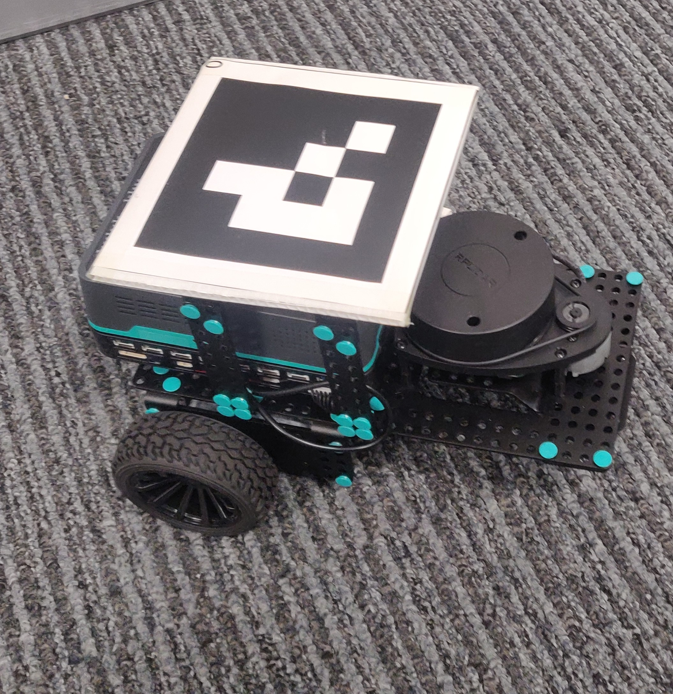

# Intelligent mobile robotics

You will be using a Pi-top for your mobile_robotics course. We should have pre-assembled your kit in advance, if this has not been done in your case, or if there are some missing parts please contact a member of staff.
Your kit should look something like this:

Where you will have

- 1 x Pitop
- 1 x Rasberry-pi (should be within Pitop)
- 1 x microSD card
- 1 x assembled robot
- 1 x Lidar

If you need to place the Rasberry-pi inside your Pi-top, please follow this [Assembly tutorial](https://www.pi-top.com/start/pi-top-4).

**You should now be ready to go !**

If your rasberry-pi hasn't been configured, please follow the Pi Configuration section. If it has progress to the programming section to learn more about the code you will work upon.

You can then test your robot, to see if the motors respond, using the remote, or simply using the initial square movement code provided in the programming section,

