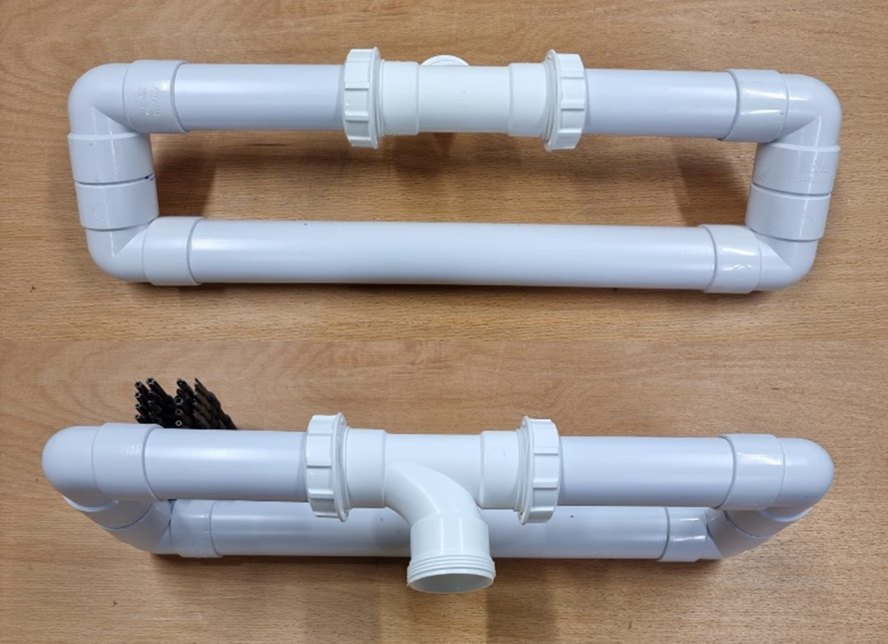
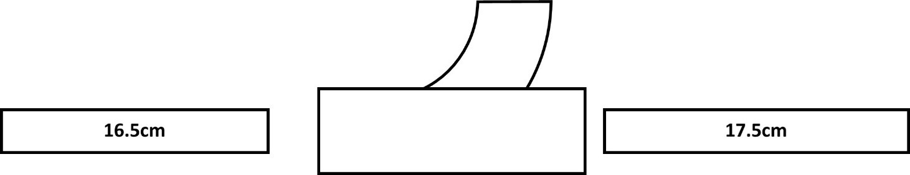
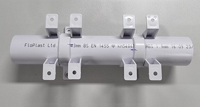
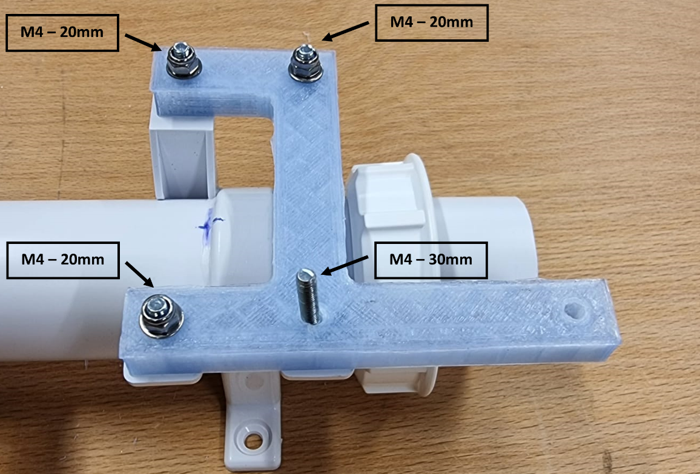
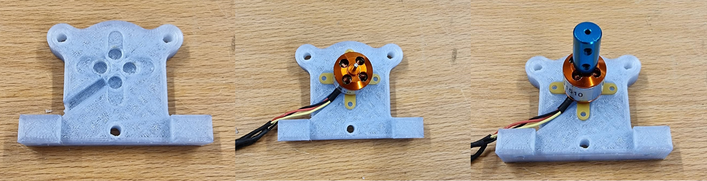
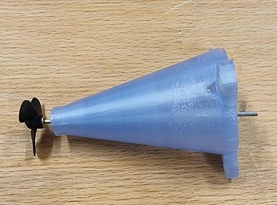
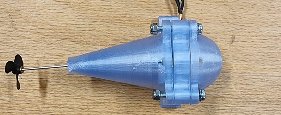
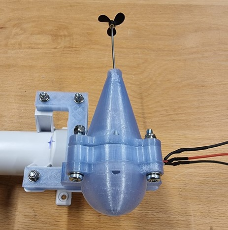
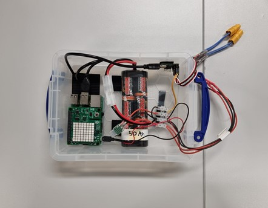
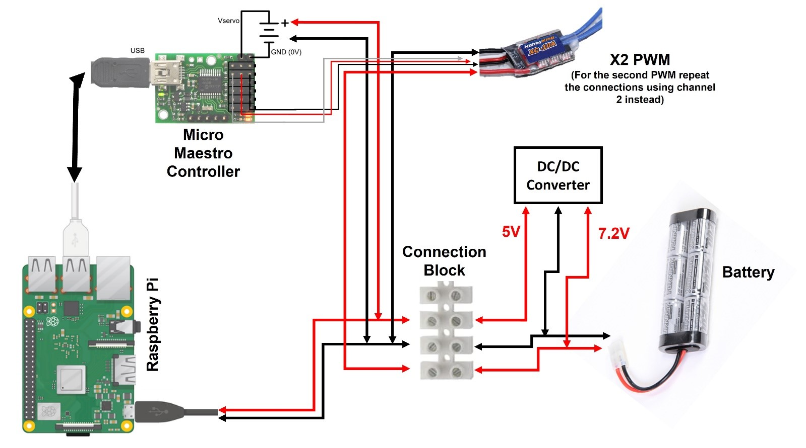

# Platform

## Fabrication

Marine platforms are fabricated from common PVC tubing and fittings. Please note that “Push-Fit” and “Solvent Weld” types have different outer diameters and are not compatible. As these platforms are glued together, all components must be “Solvent Weld” compatible.


&#8226; x1 - 3m 40mm Solvent Weld PVC Pipe : [Example](https://www.screwfix.com/p/floplast-solvent-weld-waste-pipe-white-40mm-x-3m/44310)

 >  Please cut the pipe into:
 >-	x4 – 5.5cm Tubes
 >-	x2 – 40cm Tubes
 >-	x2 – 16.5cm Tubes
 >-	x2 – 17.5cm Tubes
 >-	x1 – 25cm Tube

&#8226; x8 – 40mm 90° Bends : [Example](https://www.screwfix.com/p/floplast-bends-90-white-40mm-5-pack/90596)

&#8226; x2 – 40mm Universal Equal Tee (These are compatible with both Push-Fit and Solvent Weld piping) : [Example](https://www.screwfix.com/p/floplast-wc23-universal-compression-waste-equal-tee-white-40mm/73315)

&#8226; x6 – 40mm Pipe Clips Solvent Weld (Make sure they are Solvent Weld type as their constructions is from ABS instead of Polypropylene, allowing them to be glued to the PVC pipes) : [Example](https://www.screwfix.com/p/floplast-solvent-weld-waste-pipe-clips-white-40mm-20-pack/48555)

&#8226; x1 – Solvent Cement (Please make sure it can weld both ABS and PVC, like the example below. Use in a well-ventilated area and wear a mask if possible, fumes are very strong) : [Example](https://www.screwfix.com/p/floplast-sc250-solvent-cement-250ml/14295)



### Process

It is recommended to go through the steps without gluing anything first to familiarise yourself).
**To form one float**:

1. Following the cement instructions, form two “C”s made up of two 90° bends and a 5.5cm tube each. The glue dries fairly quickly, make sure the bends are aligned using the fabrication lines on the plastic.
2. Grab one of the “C”s and weld one 40cm tube. You should now have something that resembles an “L” shape.
3. Connect the one 16.5cm tube and one 17.5cm tube to the equal tee according to the following diagram (pay attention to the curve in the Tee being closer to the longer piece of tubing).

4. Glue the end of the 17.5cm tube to the empty 90° bend in the “L” assembly from step 2. At this point, your assembly should have a “U” shape.
5. Using the second “C” from step above, close the assembly by gluing the 40cm tube and 16.5cm to the empty 90° bends.
6. Leave to dry and repeat steps 1-5 to form the second float.

#### Centre Piece assembly

1. Grab the 25cm tube and mark 5cm from one end.

2. Place 3 pipe clips at one end, aligning the one closest to the end with the mark above. Make sure the pipe clips are aligned with each other and draw a line across the top of them and the tube (this will make alignment easier after the glue is applied).

3. Rotate the middle clip by 180 degrees and mark the tube on the opposite side.

4. One by one, apply glue to the tube and the inside of each pipe clip and weld them together. Leave to dry for 10min.

5. Repeat steps 1-4 for the other end, making sure that the clips are aligned with the previous ones as well.

## Assembly

This section describes how to put together one marine platform. Before starting, make sure you have gathered all the following materials:
PVC Parts

&#8226; x2 Floats

&#8226; x1 Centre Tube with Pipe Clips

## 3D Printed Assembly


&#8226; x2 Lower Bracket (3D Printed)

&#8226; x2 Motor Pillars (Left/Right 3D Printed)

&#8226; x2 Motor Cones (3D Printed)

&#8226; x2 Motor Domes (3D Printed)

&#8226; x2 Velcro Attachments (3D Printed)

&#8226; x10 M4 – 20mm Bolts

&#8226; x10 M4 – 30mm Bolts

&#8226; x20 M4 Nylock Nuts

&#8226; x40 M4 Washers

&#8226; x2 2mm x 300mm Threaded Shaft (Trim to right length from threaded end)

&#8226; x1 RH 30mm Propeller

&#8226; x1 LH 30mm Propeller

&#8226; x2 2mm x 2mm Shaft Couplers

&#8226; x2 BL-1510 Brushless Motors

&#8226; x2 2mm Bearings

### Control Box

&#8226; x1 Battery

&#8226; x1 Raspberry Pi with Sense Hat

&#8226; X1 Raspberry Pi Case with Foam Block

&#8226; x1 Connection Block

&#8226; x1 DC/DC Converter

&#8226; x1 Pololu Micro Maestro Controller

&#8226; x2 ESC Motor Controllers

&#8226; x1 Micro USB Cable to USB A

&#8226; x1 Micro USB Cable to Red/Black

&#8226; x1 Double Pin to Cable ends connector

&#8226; Velcro Tape


*Let’s start by assembling the structure of the marine platform.*

1. Grab the two floats and remove the screw caps from each tee and their washers.

2. At either end of the centre piece, insert the screw caps, the plastic washer and finally the black rubber washer (in that order). Make sure the inclined edge of the rubber washer faces towards the end of the tubing.

3. Connect the floats to the centre piece by screwing the caps to the tees. Ensure it is fully tightened as this will prevent water from entering and the rotation of the floats.

4. The structure is now ready!
Continue by assembling the motors:

1. Start by attaching one lower bracket (3D Printed) to the pipe clips of the centre piece as illustrated below. Remember to put a washer at either side of the part!

2. Grab the motor pillar (3D Printed) and position the motor in the cross socket. Proceed to attach one end of the coupler.

3. Take the propeller shaft provided and trim it to 94mm from the threaded end.

4. Press fit a bearing at the end of the motor cone (3D Printed), you can heat it slightly to locally melt the plastic if necessary.

5. Connect the end of the shaft to the coupler

6. Fit the shaft through the bearing and screw the propeller in (Make sure it is the correct propeller for the motor side you are assembling, they will spin in opposite directions). If you find the propeller coming loose during tests, consider super gluing it in place after you are sure they spin in the right direction.

7. You can now attach the motor cone, motor pillar and motor dome together. Insert three M4 – 30mm bolts with their respective washers through the dome first as shown below:

8. Now attach the motor assembly above to the lower bracket, do not forget the washer at either end of the M4 – 30mm bolts.

9. You have now finished mounting one motor, please repeat steps 1-8 to mount the second one.
Let’s now prepare the control box, for reference of where to place the components, please have a look at the following image:

-   Carry out the connections according to the diagram below:

