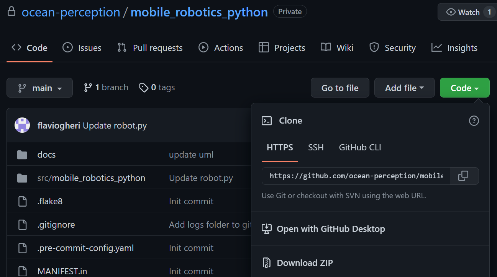
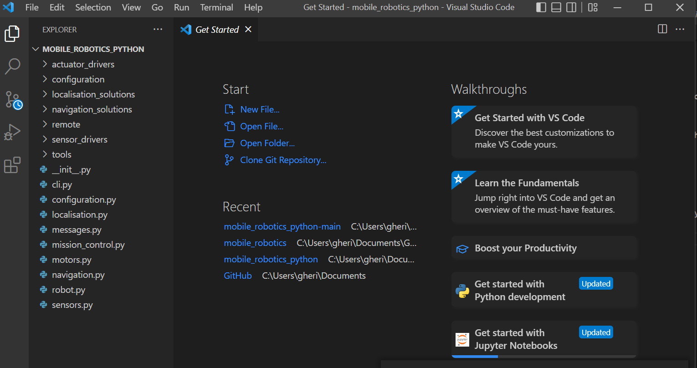
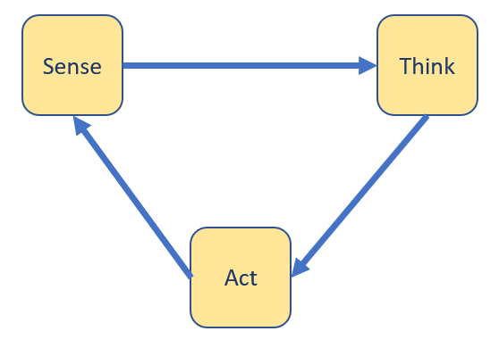
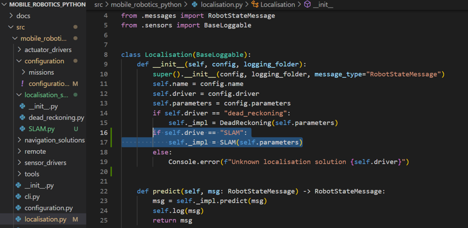
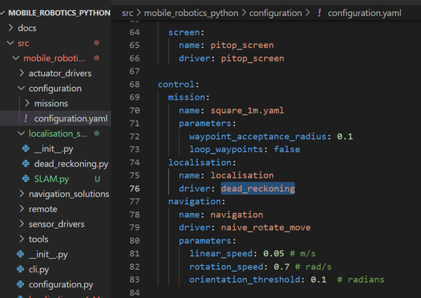

# Setting Up

Now that you have tested that the robot functions correctly. We will begin to go through the main body of code that you will be using thoughout your project.
It is highly suggested to install VS code, (a code editor like spyder and Jupyter Notebook), as it will show all the python files that you need to work with on the side.

Both the Land Rover and the Robotic vessel will use the same code. Depending on your robot, you will need to configure it in the "configuration.yaml" file.

The installation will take you to a github repository. To install, click on the code button then install the code by clicking the 'download zip' in the dropdown menu

Install VSCodeMain Code



Once installed, extract the folder and open mobile_robotics_python in vs code within mobile_robotics_python-main/mobile_robotics_python-main/src open the folder mobile_robotics_python. Once opened the folder should look something like this:


# Folder Introduction

This folder will be where you will write your code throughout the project. Although the code might look a little intimidating at first. Most of the files withing the folder will work in the background and therefore will not need to be tampered with.

The objective of your course will be to create new localization_solutions and navigations_solutions so that the robot is able to navigate autonomously to its best ability.

## How the code is structured

When the the code is run, it will got through the main loop within robot.py. In simple words it goes in a 'sense, think, act' loop.

# Simplified model of structure



as you can see in the python page, within the loop:

```
while not self.mission_control.finished:
```

there is the 3 steps:
First the code records all its sensors (it will vary depending on your robot):

## Sensing
```
            measurements = []
            if self.compass is not None:
                msg = self.compass.read()
                measurements.append(msg)
            if self.encoder is not None:
                self.encoder.yaw_rad = self.compass.yaw_rad
                msg = self.encoder.read()
                measurements.append(msg)
```
you may now change these variables based upon what robot you have:

If you have the Pitop, it might be useful to record the **compass**, **encoder**, **lidar** and **external_positioning**

If you have the robotic vessel, it might be useful to record the **encoder**, **accelerometer**, **magnetometer** and **external_positioning**

## Thinking

Once the robot has updated all the sensor data, it will use the information in order to understand it's current location. At the moment the code is using a simple 'dead_reckoning' algorithm. You may find the file inside the location_solutions folder

```
          if len(measurements) > 0:
            for measurement in sorted(measurements, key=lambda m: m.stamp_s):
              self.state = self.localisation.update(measurement)

```

Create a new file in the same location_solution folder, name it (***.py), then once you have finished the code within, you will have to change configurations to use that file instead of dead reckoning as so: 

### Editing localisation.py

Add another if statement in the localisation.py file in the mobile_robotics, (main) folder. This file directs the robot function to the appropriate localisation_solution by reading the configuration.yaml file.



Remember, if you want to follow the same structure, you will need to have a predict and update function withing your new localization solution. For example, you may choose to implement the location predictions withing the main robot loop, (as it isn't currently being utilized).


### Editing configuration.yaml

Change the driver of localization within the configuration.yaml file, (found in the configuration folder). All files refer to this yaml in order to understand which file is to implemented. In future you may want to change some of the offsets within the file as its likely that there is an offset between your sensors, motors and the centre of the robot. 

You will also be able to change the configuration of your robot. Aka changing your configuration to the correct encoder drivers and compas/magnetometer depending if you are using the robotic vessel or pitop.






Now that you have learned a little more about the configuration yaml and the main robot function. Try creating a new waypoint mission yourself and chaning the configuration.yaml !
