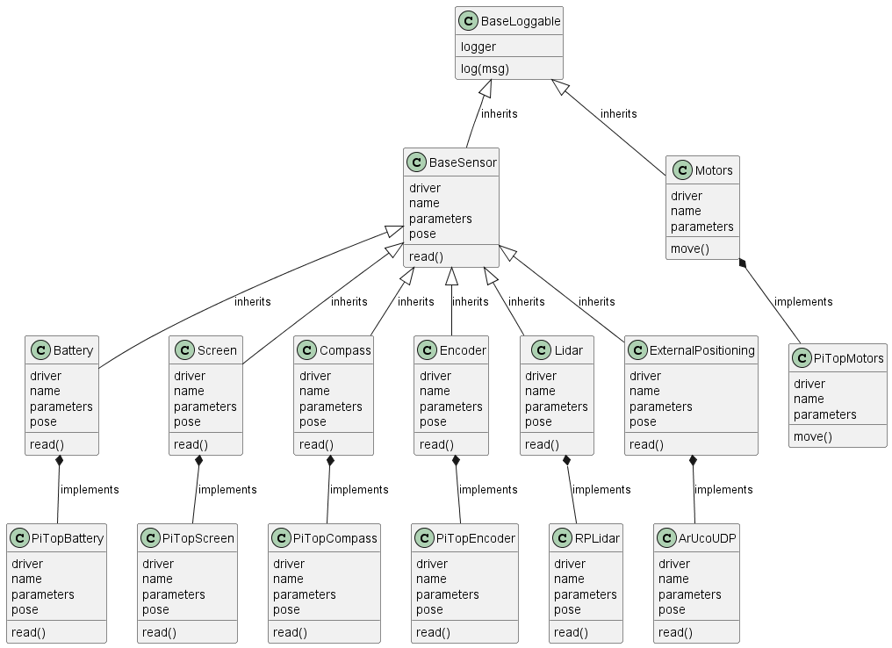
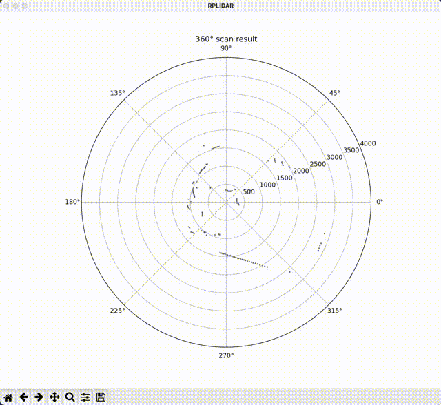

# Sensors

Depending on your robots, you should have a set of 3 or 4 different sensors contemporarily receiving data about your robots location and it's environment. The possible sensors you may have are: magnetometer, encoders, external positioning, lidar.
There might be also an option to include an accelerometer in your code if you wish so.

Some sensors will have a much higher reliability than others. For example, the external positioning is likely to be far more accurate than the encoders, as it is always observing the robot from a fixed, external reference frame.

The encoders, even if the easiest to code, as there is a continuous feedback about how much the motors have moved, can be thought to be not as reliable as they have to work on the no-slip assumption. On the current code, an assumption about their turn radius has also been made. Causing a slight variance if the robot actually has a turn radius which differs from the one assumed.

Here is an example of the robot moving in a square path based upon encoder readings and a basic navigation solution.



For more information about how the main body of code incorporates the code, proceed to the programming section

## Sensor Code Structure

The code was made in order to attempt to make the combination of information between the sensors as easily as possible

To do this, a structure, seen below was created.



The BaseLoggable class, creates seperate message format that both sensors and motors (actuators) will inherit, (and records everything that is sensed or occured). The sensors class will then configure the sensor by using the *YAML* file.

Working through the tree, the BAseLogger class logs any data it recieves, and initially sets the message format for both the BaseSensor and Motors. The BaseSensor the configuration of the sensor, (given in the yaml file), and will configure the correct message type, driver etc.. to the current sensor being recorded. Finally the Sensor records the data, given the message structure and driver.


# Sensors

## Lidar 

The lidar works by via laser triangulation. It releases very fast pulses of light toward a target and measures the amount of time it takes for the light to travel back.
The message will be saved in the form of: 
```
def log_scan(self, msg: LaserScanMessage):
        """Log the sensor data to disk."""
        self.logger.log(
            msg.stamp_s,
            msg.angle_min_rad,
            msg.angle_max_rad,
            msg.time_increment_s,
            msg.range_min_m,
            msg.range_max_m,
            str(msg.ranges),
            str(msg.intensities),
            str(msg.angles),
        )
```
Here is an example scan that the lidar made of it's surrounding space in an office.



Of course the information is still contains a fair amount of noise, as students, you will have to filter the information to then be able to use it in order to understand where the robot is with respect to neighbouring walls and maybe other rovers.

## External Localisation

The external localisation is a way to simulate gps or other external positioning methods by using camera vision. The camera recognises the tags, and to due to the nature and distinctiveness of the tags, it is able to very effectively understand both the position and rotation of the tags.

